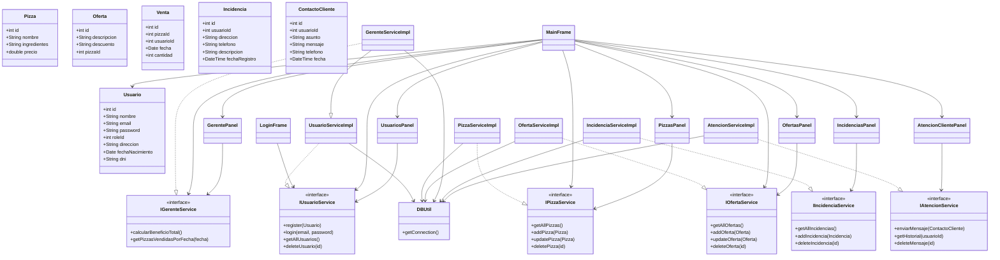

```mermaid
classDiagram
  %% Entidades
  class Usuario {
    +int id
    +String nombre
    +String email
    +String password
    +int roleId
    +String direccion
    +Date fechaNacimiento
    +String dni
  }

  class Pizza {
    +int id
    +String nombre
    +String ingredientes
    +double precio
  }

  class Oferta {
    +int id
    +String descripcion
    +String descuento
    +int pizzaId
  }

  class Venta {
    +int id
    +int pizzaId
    +int usuarioId
    +Date fecha
    +int cantidad
  }

  class Incidencia {
    +int id
    +int usuarioId
    +String direccion
    +String telefono
    +String descripcion
    +DateTime fechaRegistro
  }

  class ContactoCliente {
    +int id
    +int usuarioId
    +String asunto
    +String mensaje
    +String telefono
    +DateTime fecha
  }

  %% Interfaces de servicio
  class IUsuarioService {
    <<interface>>
    +register(Usuario)
    +login(email, password)
    +getAllUsuarios()
    +deleteUsuario(id)
  }

  class IPizzaService {
    <<interface>>
    +getAllPizzas()
    +addPizza(Pizza)
    +updatePizza(Pizza)
    +deletePizza(id)
  }

  class IOfertaService {
    <<interface>>
    +getAllOfertas()
    +addOferta(Oferta)
    +updateOferta(Oferta)
    +deleteOferta(id)
  }

  class IGerenteService {
    <<interface>>
    +calcularBeneficioTotal()
    +getPizzasVendidasPorFecha(fecha)
  }

  class IIncidenciaService {
    <<interface>>
    +getAllIncidencias()
    +addIncidencia(Incidencia)
    +deleteIncidencia(id)
  }

  class IAtencionService {
    <<interface>>
    +enviarMensaje(ContactoCliente)
    +getHistorial(usuarioId)
    +deleteMensaje(id)
  }

  %% Implementaciones
  class UsuarioServiceImpl
  class PizzaServiceImpl
  class OfertaServiceImpl
  class GerenteServiceImpl
  class IncidenciaServiceImpl
  class AtencionServiceImpl

  UsuarioServiceImpl ..|> IUsuarioService
  PizzaServiceImpl ..|> IPizzaService
  OfertaServiceImpl ..|> IOfertaService
  GerenteServiceImpl ..|> IGerenteService
  GerenteServiceImpl --|> UsuarioServiceImpl
  IncidenciaServiceImpl ..|> IIncidenciaService
  AtencionServiceImpl ..|> IAtencionService

  %% DB
  class DBUtil {
    +getConnection()
  }

  UsuarioServiceImpl --> DBUtil
  PizzaServiceImpl --> DBUtil
  OfertaServiceImpl --> DBUtil
  GerenteServiceImpl --> DBUtil
  IncidenciaServiceImpl --> DBUtil
  AtencionServiceImpl --> DBUtil

  %% GUI
  class LoginFrame
  class MainFrame
  class PizzasPanel
  class OfertasPanel
  class UsuariosPanel
  class GerentePanel
  class IncidenciasPanel
  class AtencionClientePanel

  LoginFrame --> IUsuarioService
  MainFrame --> Usuario
  MainFrame --> IPizzaService
  MainFrame --> IOfertaService
  MainFrame --> IUsuarioService
  MainFrame --> IGerenteService
  MainFrame --> PizzasPanel
  MainFrame --> OfertasPanel
  MainFrame --> UsuariosPanel
  MainFrame --> GerentePanel
  MainFrame --> IncidenciasPanel
  MainFrame --> AtencionClientePanel

  PizzasPanel --> IPizzaService
  OfertasPanel --> IOfertaService
  UsuariosPanel --> IUsuarioService
  GerentePanel --> IGerenteService
  IncidenciasPanel --> IIncidenciaService
  AtencionClientePanel --> IAtencionService
```